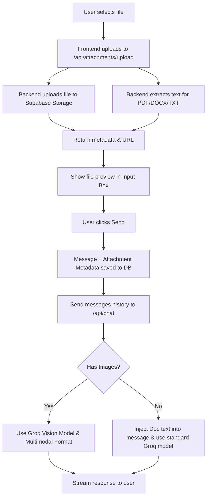

# Implementation Plan - File Uploads (PDF, Images, Docs) for Chatbot

Enable the AI chatbot to accept, visualize, and understand uploaded files (images, PDFs, DOCX, TXT) and answer questions about them.

## Technical Summary: How Groq Processes Uploads

> [!IMPORTANT]
> **1. Handling Images (Vision Model Switch)**
> - Standard chat requests use Groq's text-only model (`llama-3.3-70b-versatile`).
> - When a message has image attachments, the backend will dynamically switch the model to Groq's vision model (`llama-3.2-11b-vision-preview` or `llama-3.2-90b-vision-preview`).
> - The message payload is formatted using Groq's OpenAI-compatible content array structure:
>   ```json
>   {
>     "role": "user",
>     "content": [
>       { "type": "text", "text": "User's query text here" },
>       { "type": "image_url", "image_url": { "url": "https://zgghxjyvummgcqkfxhqi.supabase.co/storage/v1/object/public/chat-attachments/..." } }
>     ]
>   }
>   ```

> [!IMPORTANT]
> **2. Handling PDFs and Docs (Server-Side Text Extraction)**
> - Groq's models do not accept raw PDF or Word binary files. Instead, the backend extracts the text from these files using parser libraries.
> - The extracted text is injected directly into the LLM conversation prompt:
>   ```markdown
>   [Document Attachment: sales_report.pdf]
>   ---
>   <Extracted text of the document here>
>   ---
>   
>   User Prompt: Summarize the sales report.
>   ```
> - Because Groq's models feature a **128k context window** (approx. 90,000 words), standard PDFs and documents fit entirely within the prompt, ensuring complete and accurate understanding without needing a vector database index.

---

## Open Questions And Their Answers

> [!NOTE]
> 1. **Storage Expiration:** Should we delete uploaded attachments after a certain duration (e.g. 30 days) to save storage space in Supabase, or keep them indefinitely as part of the conversation history?
> ANS: yes 30 days deletion plan is good

> 2. **File Size Limits:** We propose a file size limit of 10MB per file. Is that acceptable, or do you have other limits in mind?
> ANS: i think a little higher limit would be much better like something between 20 and 50

---

## Proposed Changes

We will implement this feature across the database storage layer, backend routes, AI logic, and frontend components.



### 1. Database & Storage Layer (Supabase)

> [!NOTE]
> **Database column updated:** The `attachments` column (`JSONB` default `[]`) has already been added to the `messages` table.

#### [NEW] Supabase Storage Bucket Configuration
Create a new bucket named `chat-attachments` in Supabase Storage with the following configuration:
- **Public:** Yes (so the LLM and browser can fetch file URLs easily).
- **Allowed MIME Types:** `image/*`, `application/pdf`, `text/plain`, `application/vnd.openxmlformats-officedocument.wordprocessingml.document` (DOCX).
- **Row-Level Security (RLS) Policies:**
  - **Select:** Allow anyone to read (or authenticated users).
  - **Insert/Update/Delete:** `auth.uid() = owner` (only the authenticated uploader can modify/delete files under their `chat-attachments/{owner_id}/` folder structure).

---

### 2. Backend Environment & Packages

#### [MODIFY] [package.json](file:///d:/TahaAsif/My-Worspace/Ai%20Bot/f1-chatbot/package.json)
Install parser packages for extraction:
- `pdf-parse`: For extracting text from PDF files.
- `mammoth`: For extracting text from Word (DOCX) files.

---

### 3. Backend Endpoints

#### [NEW] [upload.js](file:///d:/TahaAsif/My-Worspace/Ai%20Bot/f1-chatbot/app/api/attachments/upload/route.js)
Create an API route `/api/attachments/upload` to handle file uploads and document parsing.
- Receives file via `FormData` (`multipart/form-data`).
- Authenticates the user.
- Uploads the file to Supabase Storage under `chat-attachments/${userId}/${uuid}-${fileName}`.
- If it's a PDF, DOCX, or TXT file, parses the text content on the fly.
- Returns JSON metadata:
  ```json
  {
    "id": "uuid",
    "name": "sales_report.pdf",
    "type": "application/pdf",
    "url": "https://zgghxjyvummgcqkfxhqi.supabase.co/storage/v1/object/public/chat-attachments/...",
    "size": 104523,
    "extractedText": "..."
  }
  ```

---

### 4. AI & Completion Logic

#### [MODIFY] [groq.js](file:///d:/TahaAsif/My-Worspace/Ai%20Bot/f1-chatbot/lib/groq.js)
Update message preparation and streaming:
- **`normalizeChatMessages(messages)`**: 
  - Change to retain attachment data associated with each message.
- **`createGroqChatStream(messages)`**:
  - Check if any message in the context has images.
  - If images are present, set `model` to `llama-3.2-11b-vision-preview` (or config equivalent).
  - Format user messages with image attachments into Groq's multimodal content array:
    ```javascript
    content: [
      { type: "text", text: userPrompt },
      { type: "image_url", image_url: { url: imageUrl } }
    ]
    ```
  - For messages with document attachments (PDF, DOCX, TXT):
    - Inject the extracted text at the top of the message content:
      ```markdown
      [Document Attachment: sales_report.pdf]
      ---
      EXTRACTED TEXT CONTENT
      ---
      
      User Prompt: Explain this document.
      ```
    - Use standard text completion models.

#### [MODIFY] [route.js](file:///d:/TahaAsif/My-Worspace/Ai%20Bot/f1-chatbot/app/api/messages/route.js)
Modify GET and POST handlers:
- Include the `attachments` column in `SELECT_COLUMNS` so that past attachments are retrieved when reloading conversations.
- Insert the `attachments` JSON array in the POST body when saving new messages.

---

### 5. Frontend UI/UX Integration

#### [MODIFY] [ChatInput.jsx](file:///d:/TahaAsif/My-Worspace/Ai%20Bot/f1-chatbot/components/chat/ChatInput.jsx)
- Add a paperclip button `📎` next to the text input.
- Create a hidden `<input type="file" multiple />` that triggers on paperclip click.
- Implement an attachment preview bar above the input text field showing selected/uploaded files.
- Display file upload progress indicators (e.g. spinning loading indicators) on the preview items.
- Provide a delete `✕` button to remove files before sending.
- Implement drag-and-drop file listeners across the input area.

#### [MODIFY] [useChat.js](file:///d:/TahaAsif/My-Worspace/Ai%20Bot/f1-chatbot/hooks/useChat.js)
- Track state: `pendingAttachments` (list of attachments currently uploading/uploaded for the current input) and `isUploading`.
- Implement `handleFileChange`: uploads files immediately to `/api/attachments/upload` and adds them to `pendingAttachments`.
- Update `handleSend`:
  - Pass the current `pendingAttachments` array to the `saveMessage` API call for the user message.
  - Clear `pendingAttachments` after sending.
  - Form the payload for the streaming chat endpoint.

#### [MODIFY] [ChatMessage.jsx](file:///d:/TahaAsif/My-Worspace/Ai%20Bot/f1-chatbot/components/chat/ChatMessage.jsx)
- Display attachment thumbnails or file-attachment cards beneath the text content inside the user's message bubble.
- Render images as expandable thumbnail images.
- Render PDFs and documents as structured card links with an icon (PDF/DOC) and the file name, linking to the storage URL.

---

## Verification Plan

### Automated Tests
- Test parsing endpoints with mockup `FormData` inputs.
- Validate Groq vision response structure using mock message payloads.

### Manual Verification that i will do on my own
1. **Upload Verification:**
   - Drag and drop a PNG image, a PDF, and a DOCX file into the chatbot.
   - Verify upload progress indicator displays and successfully completes.
   - Confirm files are written into the Supabase bucket structure: `chat-attachments/{user_id}/`.
2. **AI Comprehension Verification:**
   - **Image:** Upload a flowchart or sketch, ask the bot: *"Describe the layout and text in this image."*
   - **PDF:** Upload a short PDF report, ask: *"Summarize section 3 of this document."*
   - **DOCX:** Upload a document, ask details on specific items in the document.
   - Confirm that the assistant references the correct data without hallucinating.
3. **History Verification:**
   - Refresh the page, switch conversations, and ensure attachments still display in the message history bubbles.
